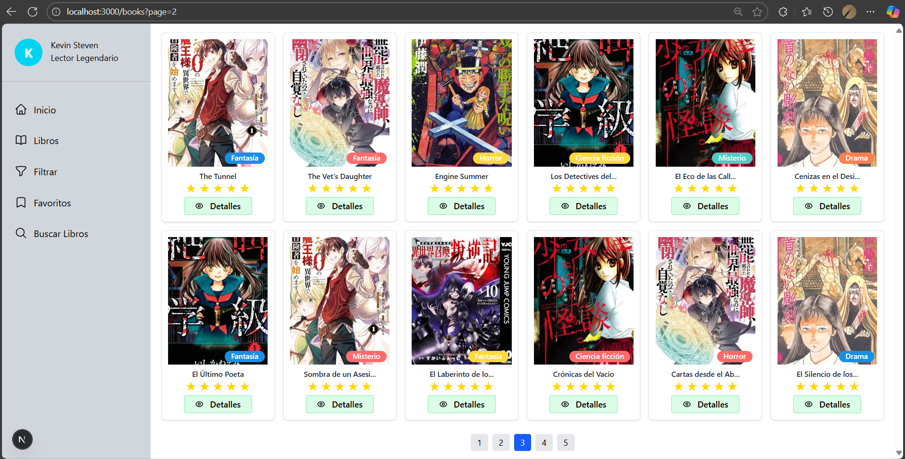
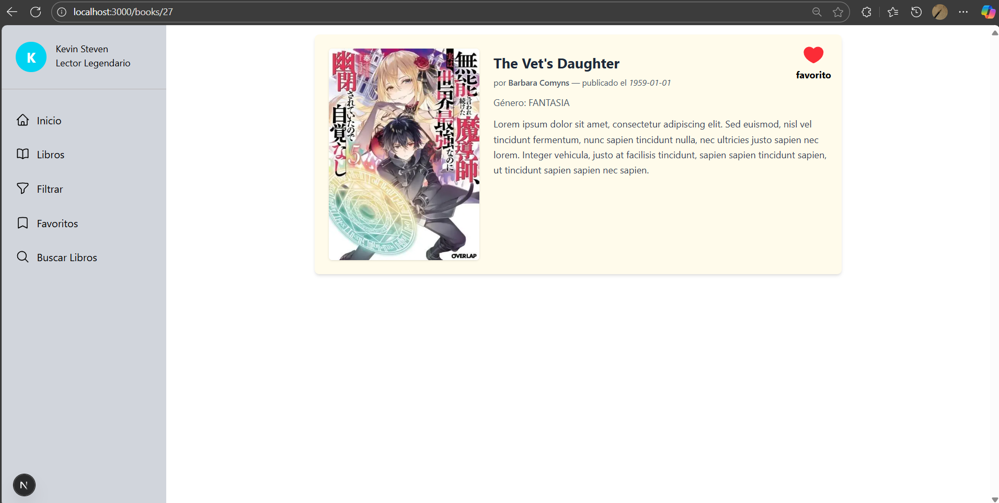
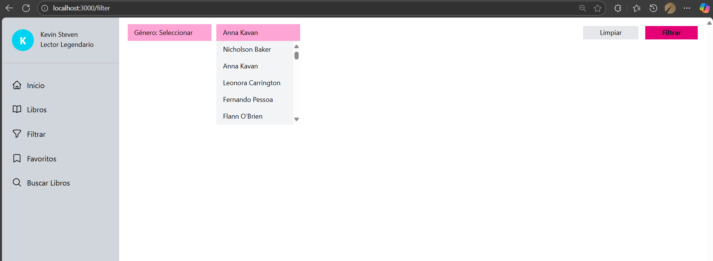
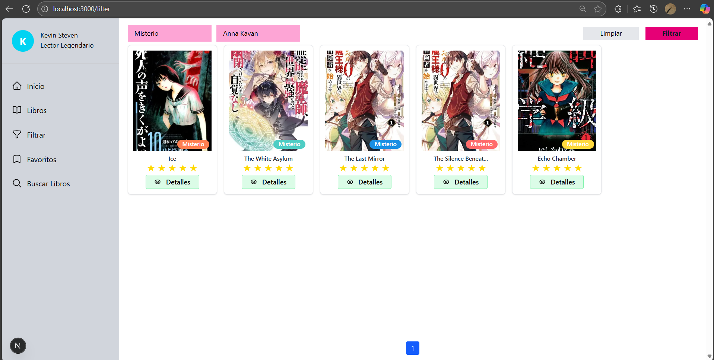
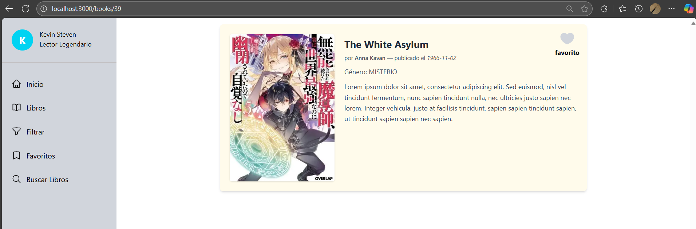
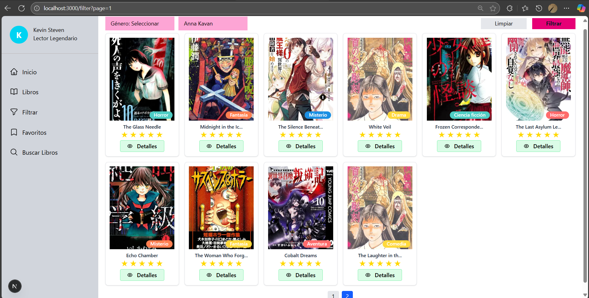

# MINIMARKETPLACE_BOOKS

## Tecnologías

**Web:** Next.js, Zustand, Tailwind CSS  
**Backend / Service:** Spring Boot, PostgreSQL  
**Mock API (sin usar):** json-server

---

## Funcionalidades

- Listar libros  
- Filtros: autor, género  
- Ver detalles de un libro (`books/123`)  
- Navbar || sidebar  
- Gestión de libros favoritos (falta XD)

---

## Ejecución

Para iniciar el proyecto en paralelo (web y service):

```bash
npm run dev
```







